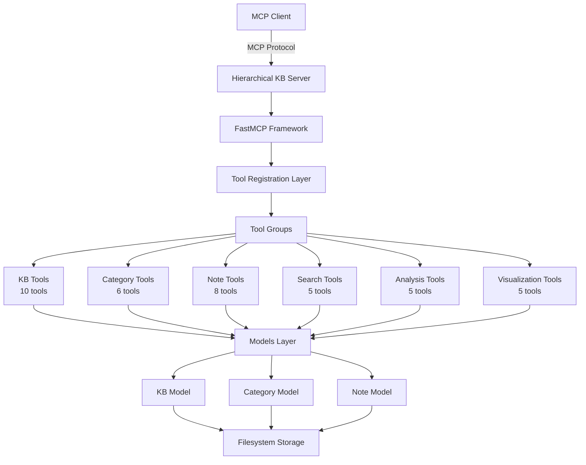
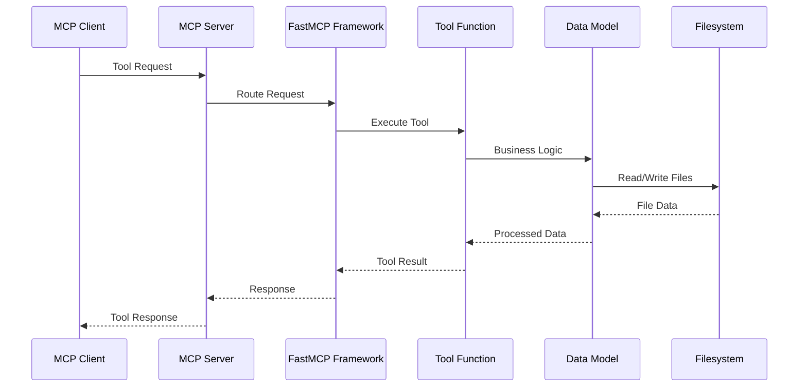

# KB_mcp Architecture

## System Overview

The Hierarchical Knowledge Base MCP Server is a Model Context Protocol server that implements a filesystem-based knowledge management system with true hierarchical organization, cross-references, and advanced features like codebase analysis.



## Server Information

- **Protocol Version**: 2024-11-05
- **Server Name**: hierarchical-kb
- **Server Version**: 1.6.0
- **Total Tools**: 39 tools across 6 categories

## Storage Architecture

```
~/.hierarchical-kb/storage/
├── Knowledge_Base_Name/
│   ├── meta.json                    # KB metadata
│   │   {
│   │     "id": "kb_unique_id",
│   │     "title": "Knowledge Base Name",
│   │     "description": "Description",
│   │     "created_at": "2025-05-18T10:00:00Z",
│   │     "updated_at": "2025-05-18T10:00:00Z",
│   │     "tags": ["tag1", "tag2"],
│   │     "parent_kb": null,
│   │     "derived_from": null,
│   │     "relationships": {
│   │       "related_kbs": ["kb_id_1", "kb_id_2"]
│   │     }
│   │   }
│   ├── Category_Name/
│   │   ├── category.json           # Category metadata
│   │   │   {
│   │   │     "name": "Category Name",
│   │   │     "description": "Category description",
│   │   │     "created_at": "2025-05-18T10:00:00Z",
│   │   │     "parent": null,
│   │   │     "tags": ["tag1"]
│   │   │   }
│   │   ├── Note_Title.md          # Note with YAML frontmatter
│   │   └── Subcategory/
│   │       ├── category.json
│   │       └── Note_2.md
│   └── Category_2/
│       └── ...
└── Other_Knowledge_Base/
    └── ...
```

## Note Format

```markdown
---
title: "Note Title"
created_at: "2025-05-18T10:00:00Z"
updated_at: "2025-05-18T10:00:00Z"
tags: ["tag1", "tag2"]
linked_notes: ["note_id_1", "note_id_2"]
linked_kbs: ["kb_id_1"]
references:
  - type: "url"
    value: "https://example.com"
  - type: "file"
    value: "/path/to/file"
---

# Note Content

This is the markdown content of the note.

Cross-references use [[note_id]] syntax.
KB references use [[kb:kb_id]] syntax.
```

## Tool Categories and Functions

### 1. Knowledge Base Management (10 tools)
- `get_status`: Get current server status and configuration
- `create_kb`: Create a new knowledge base
- `list_kbs`: List all available knowledge bases
- `select_kb`: Select a knowledge base for current operations
- `get_current_kb`: Get information about the currently selected KB
- `rename_kb`: Rename a knowledge base
- `delete_kb`: Delete a knowledge base
- `derive_kb`: Create a derived knowledge base from an existing one
- `export_kb`: Export a knowledge base to JSON format
- `import_kb`: Import a knowledge base from JSON format

### 2. Category Management (6 tools)
- `create_category`: Create a new category
- `list_categories`: List categories in the current KB
- `rename_category`: Rename a category
- `move_category`: Move a category to a new parent
- `delete_category`: Delete a category and its contents
- `get_category_contents`: Get contents of a specific category

### 3. Note Management (8 tools)
- `create_note`: Create a new note
- `read_note`: Read a note's content
- `update_note`: Update a note's content
- `delete_note`: Delete a note
- `move_note`: Move a note to another category
- `list_notes`: List notes in the current KB
- `link_notes`: Create links between notes
- `unlink_notes`: Remove links between notes

### 4. Search and Discovery (5 tools)
- `search_notes`: Search notes by content or metadata
- `search_with_ripgrep`: Advanced search using ripgrep
- `find_related_notes`: Find notes related to a given note
- `search_by_date`: Search notes by date range
- `find_orphaned_notes`: Find notes without any links

### 5. Codebase Analysis (5 tools)
- `analyze_codebase`: Analyze a codebase structure
- `extract_patterns`: Extract patterns from code
- `generate_documentation`: Generate documentation from code
- `sync_codebase`: Sync codebase changes with KB
- `analyze_dependencies`: Analyze project dependencies

### 6. Visualization (5 tools)
- `generate_kb_graph`: Generate knowledge base graph
- `generate_link_graph`: Generate link relationships graph
- `generate_kb_hierarchy_tree`: Generate hierarchy tree visualization
- `generate_tag_cloud`: Generate tag cloud visualization
- `generate_kb_stats`: Generate KB statistics

## Data Flow



## Key Design Decisions

1. **Filesystem-based Storage**: Direct filesystem storage for unlimited scalability and no token limits
2. **Markdown + YAML Frontmatter**: Human-readable format for notes with structured metadata
3. **True Hierarchical Organization**: Categories as directories provide real hierarchy
4. **Cross-reference System**: Built-in linking between notes and knowledge bases
5. **Migration Support**: Tools to convert from legacy JSON-based systems
6. **FastMCP Framework**: Simplified MCP server implementation with automatic protocol handling
7. **Global State Management**: Centralized state for current KB selection and storage path
8. **Modular Tool Organization**: Tools organized in logical groups with separate registration functions

## Configuration

### Environment Variables
- `HIERARCHICAL_KB_STORAGE`: Override default storage path (default: `~/.hierarchical-kb/storage`)
- `PYTHONPATH`: Must include the src directory for module imports

### Default Paths
- Storage: `~/.hierarchical-kb/storage`
- Configuration: Via environment variables

### Claude Desktop Integration
```json
{
  "mcpServers": {
    "hierarchical-kb": {
      "command": "/path/to/python",
      "args": ["/path/to/src/main.py"],
      "env": {
        "PYTHONPATH": "/path/to/src",
        "HIERARCHICAL_KB_STORAGE": "~/.hierarchical-kb/storage"
      }
    }
  }
}
```

## Security Considerations

1. **Path Validation**: All file operations are restricted to the storage directory
2. **Input Sanitization**: File names and paths are sanitized to prevent directory traversal
3. **Error Handling**: Comprehensive error handling prevents information leakage
4. **State Isolation**: Each KB operates independently with isolated state

## Performance Features

1. **Lazy Loading**: Notes and categories are loaded on demand
2. **Efficient Search**: Ripgrep integration for fast full-text search
3. **Minimal Memory Footprint**: Filesystem-based storage reduces memory usage
4. **Parallel Operations**: FastMCP supports async operations for better performance

## Future Architecture Considerations

1. **Version Control Integration**: Git integration for KB versioning
2. **Collaborative Features**: Multi-user support with conflict resolution
3. **Plugin System**: Extensible architecture for custom tools
4. **API Gateway**: REST API for external integrations
5. **Real-time Sync**: WebSocket support for live updates